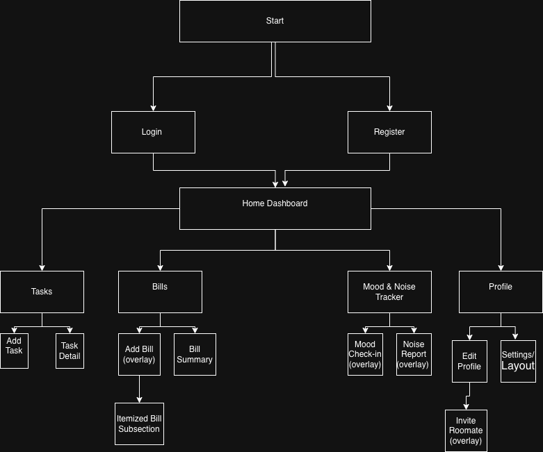
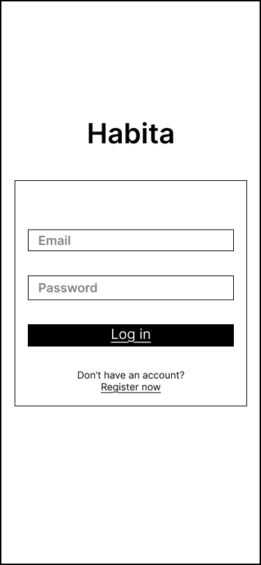
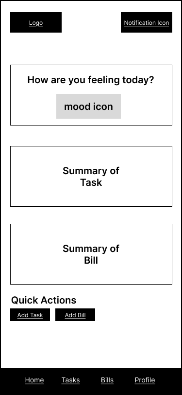
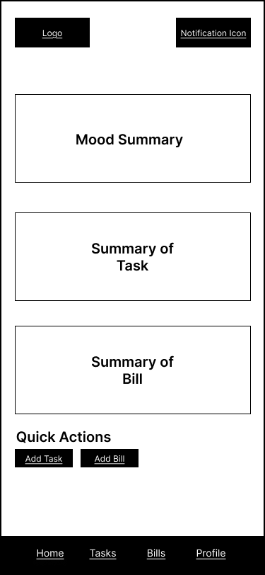
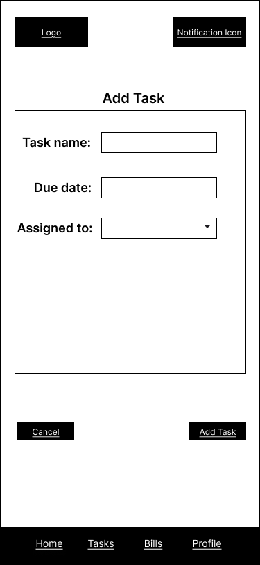
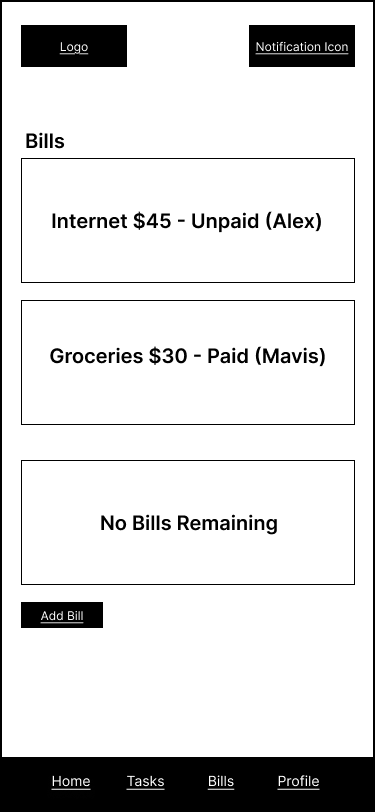
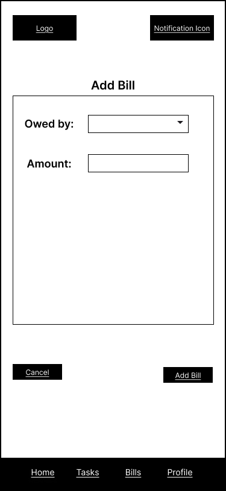
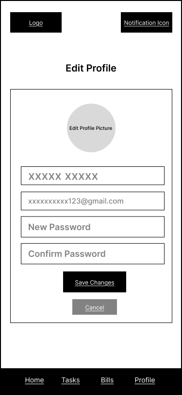
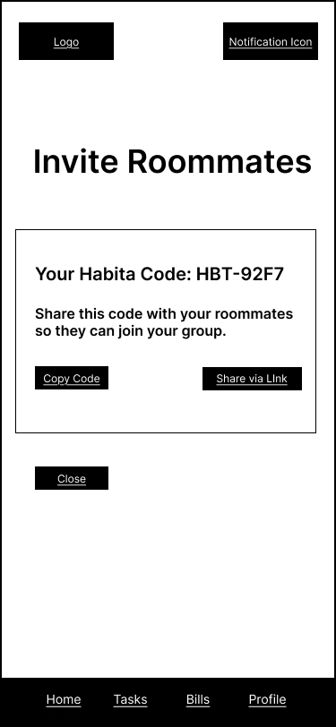

# User Experience Design

## 0. Prototype

You can view the interactive Figma prototype for the Habita MVP here:  
👉 [View Habita Prototype](https://www.figma.com/design/9lgAQPMoD53RPM8WSDJSyH/Habita?node-id=0-1&t=2bmqEnaVm2sJvvdJ-1)

The prototype demonstrates the core user flow:
- Registration and group joining with a Habita code  
- Home Dashboard overview of shared living activities  
- Daily Mood Check-in integrated directly in the dashboard  
- Task management (add, view, complete)  
- Bill splitting and summary  
- Profile page with roommate invite overlay  

---

## 1. App Map

The app map shows the hierarchy and navigation flow of the Habita MVP.  
Users start from the Login screen and can access the Home Dashboard after signing in.  
From the Home Dashboard, they can view tasks, bills, and daily mood stats, then navigate to Profile through the bottom navigation bar.

  

---

## 2. Wireframes

### Login Screen

Allows users to log in using email and password. Includes a link to Register.

---

### Home Dashboard

Central hub displaying summaries of shared living activities — including upcoming tasks, unpaid bills, and a lightweight Mood & Noise Tracker section.

#### Mood & Noise Tracker (inline)

Users tap one emoji to record their daily mood and optionally note noise level.  
After submission, the tracker disappears and shows the group’s weekly average.

---

### Tasks

Displays all shared tasks with completion checkboxes.

#### Add Task Overlay

Overlay for adding new tasks with title, due date, and assignee fields.

---

### Bills

Lists shared expenses, showing payer, amount, and payment status.

#### Add Bill Overlay

Allows users to log new shared expenses and split costs between roommates.

#### Bill Summary

Displays total owed and balance overview for each roommate.

---

### Profile

Shows user info, group details, and access to roommate management options.

#### Invite Roommate Overlay

Displays a unique Habita Code that can be copied or shared for inviting new roommates.

---

## 3. Design Notes

- All wireframes follow a **mobile-first layout**.  
- Only grayscale elements are used (no color or real images).  
- Navigation bar remains consistent across all screens.  
- Overlays appear centered and can be closed with “Cancel” or by tapping outside.  
- The **Mood & Noise Tracker** is embedded in the Home Dashboard, disappearing after daily submission to reveal summary data.

---

## 4. Summary

The Habita MVP simplifies shared living through one centralized mobile dashboard.  
It unites roommates around tasks, bills, and communication — enhanced by a subtle well-being tracker.  
The design emphasizes clarity, quick interaction, and seamless collaboration.
