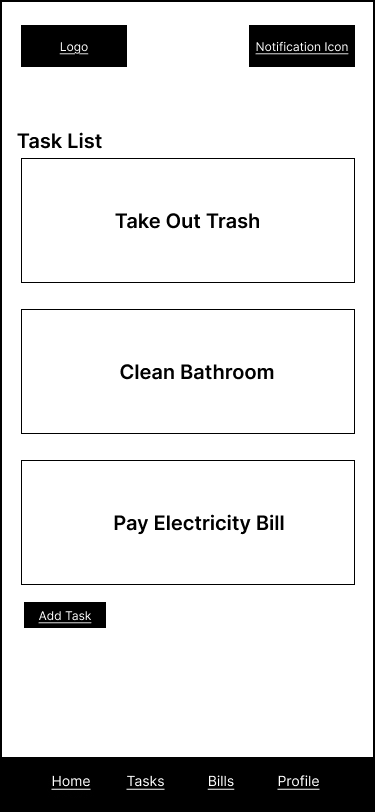

# User Experience Design

## 0. Prototype
You can view the interactive Figma prototype for the Habita MVP here:  
👉 [View Habita Prototype](https://www.figma.com/design/9lgAQPMoD53RPM8WSDJSyH/Habita?node-id=0-1&p=f&t=2bmqEnaVm2sJvvdJ-0)

The prototype demonstrates the core user flow:
- Registration and group joining with a Habita code  
- Home Dashboard overview of shared living activities  
- Task management (add, view, complete)  
- Bill splitting  
- Profile page for viewing or inviting roommates  

---

## 1. App Map
The app map shows the hierarchy and navigation flow of the Habita MVP.  
Users start from the Login screen and can access the Home Dashboard after signing in.  
From the Home Dashboard, they can navigate to Tasks, Bills, Shopping List, Mood & Noise, and Profile using the bottom navigation bar.

---

## 2. Wireframes

### Login Screen
Purpose: Allows users to log in with email and password. Includes a link to Register.

---

### Register Screen
Purpose: Lets new users create an account and optionally join a roommate group using a join code.

---

### Home Dashboard
Purpose: Central hub showing key summaries such as upcoming tasks and unpaid bills.

---

### Tasks
  
Purpose: Displays all tasks shared among roommates. Each task has a checkbox for completion.

---

### Add Task Overlay
Purpose: Overlay for adding a new task with title, due date, and assignee fields.

---

### Bills
 
Purpose: Lists all shared expenses with payer, amount, and payment status.

---

### Add Bill Overlay
Purpose: Allows users to add new expenses.

---

### Bill Summary
Purpose: Shows the total amount, payer, and a clear breakdown of each person’s share.  
Users can confirm payments or request settlements.

---

### Profile
Purpose: Shows user information, group details, and options to edit profile or log out.  
Includes a button to “Invite Roommates,” which opens an overlay displaying the group’s Habita Code and share options.

---

### Invite Roommate Overlay
Purpose: Overlay for sharing the roommate group’s unique Habita Code.  
Users can copy or share the code so that new roommates can join the group easily.

---

### Edit Profile
Purpose: Allows users to update their name, group info, or notification settings.

---

## 3. Notes
- All wireframes follow a mobile-first layout.  
- Only grayscale elements are used (no colors, icons, or real images).  
- Navigation bar remains consistent across all screens.  
- Overlays appear above the base screen and are closed with a cancel or save action.
